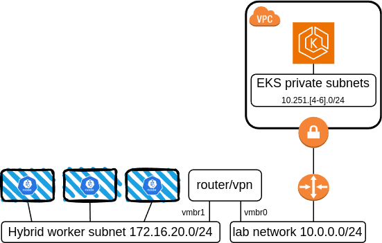

# aws-eks-hybrid-demo
Demonstration of AWS' EKS hybrid nodes using Proxmox on-premises

I used these terraform samples to rapidly build/destroy a test environment made of:
* A new VPC with 3 private subnets for EKS and 3 public subnets for internet access via a single NAT gateway
* A site to site VPN to an on-premise network (the router is a Proxmox VM running debian/libreswan)
* A private EKS cluster ready to add Amazon linux hybrid nodes using SSM
* One or more AL2023 worker VMs joining the EKS cluster (the Amazon Linux 2023 is already there as a template)



From there I could test a series of things where I kept the Kubernetes related files (under k8s) to test hybrid scenarios such as load balancing from onprem with MetalLB and NLBs/ALBs from AWS

I used the AWS CNI in its default configuration for EC2 node pool and Cilium CNI for the onprem nodes.  Static routing is used in this setup,  meaning the router on onprem side knows how to reach the POD CIDR through each of the worker node.

The AWS infrastructure Terraform outputs a test SSM activation token/id valid for 24 hours that you can pass as input to the Proxmox Terraform. I do need to bring up the S2S VPN every time between the router and the AWS infra deployment before deploying the Proxmox VMs since they join the private EKS cluster on fist boot assuming it is reacheable at that time.  To run the Proxmox terraform, you do need to set creds as described https://registry.terraform.io/providers/Telmate/proxmox/latest/docs

Note the Proxmox TF assumes local storage only (local and local-lvm storage used)

If everything runs as exptected you will see your EC2 nodes in ready state (since they have the AWS CNI installed by TF) and hybrid nodes not ready yet:

```
NAME                                            STATUS     ROLES    AGE    VERSION
ip-10-251-4-144.ca-central-1.compute.internal   Ready      <none>   89m    v1.31.3-eks-59bf375
ip-10-251-5-65.ca-central-1.compute.internal    Ready      <none>   89m    v1.31.3-eks-59bf375
ip-10-251-6-72.ca-central-1.compute.internal    Ready      <none>   89m    v1.31.3-eks-59bf375
mi-035612947272a6bb8                            NotReady   <none>   61s    v1.31.2-eks-94953ac
mi-068527f488606153d                            NotReady   <none>   83s    v1.31.2-eks-94953ac
mi-0ba42d47bbed0b34c                            NotReady   <none>   2m8s   v1.31.2-eks-94953ac
```

Installing the CNI via helm will bring them to Ready state.
```
helm repo add cilium https://helm.cilium.io/
helm install cilium cilium/cilium \
    --version 1.16 \
    --namespace kube-system \
    --values k8s/cilium-values.yaml
```


Then the AWS ingress controller and MetalLB
```
helm repo add eks https://aws.github.io/eks-charts
helm install aws-load-balancer-controller eks/aws-load-balancer-controller -n kube-system --values k8s/alb-values.yaml

<wait for its webhook to be ready...>

helm repo add metallb https://metallb.github.io/metallb
helm install metallb metallb/metallb -f k8s/metallb-values.yaml -n metallb-system --create-namespace
kubectl apply -f k8s/metallb-l2.yaml
```

Note the SSH pub key is required for the Proxmox Terraform to run the SSM de-registration from each worker node on terraform destroy.  It also will not perform the deletion of the nodes in the EKS cluster.